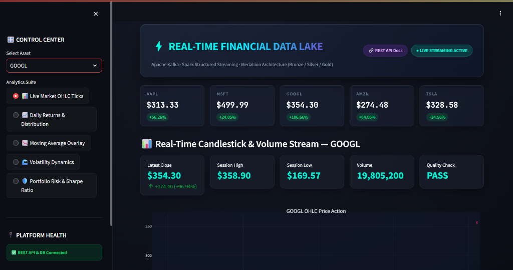
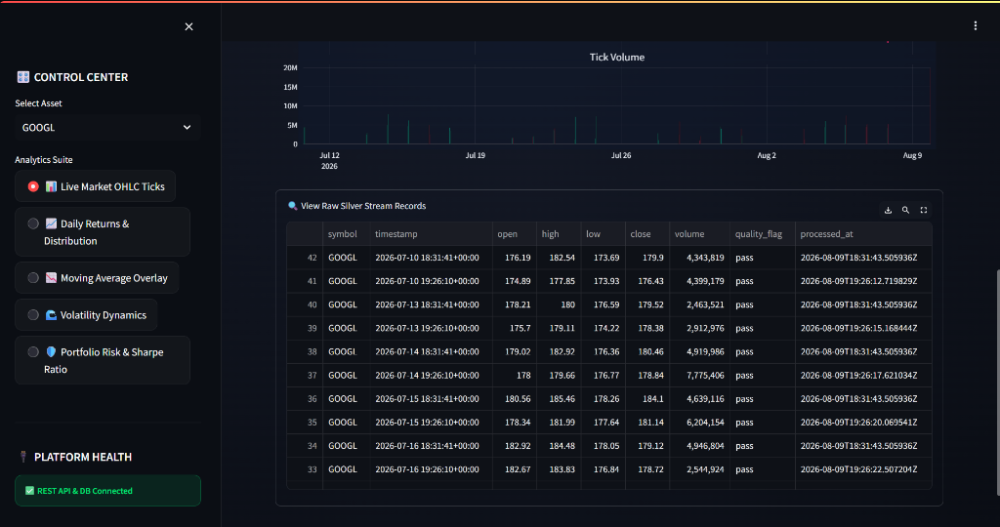
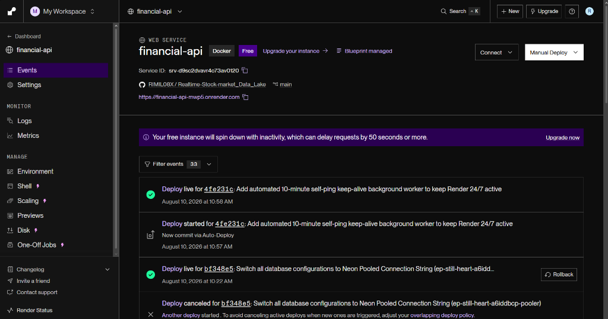
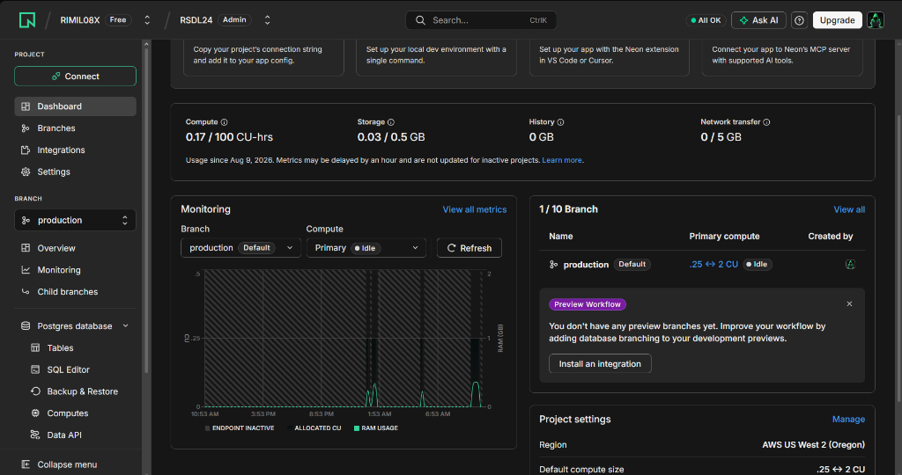

# ⚡ Real-Time Stock Market Data Lake & Stream Processing Engine

[](https://streamlit-dashboard-bxxa.onrender.com)
[](https://financial-api-mwp5.onrender.com/docs)
[](https://spark.apache.org/)
[](https://kafka.apache.org/)
[](https://neon.tech/)
[](https://www.docker.com/)

A production-grade, distributed real-time financial data lake and analytical stream processing platform built with **Apache Kafka**, **PySpark Structured Streaming**, and **PostgreSQL (Neon Cloud)**, organized around an enterprise **Medallion Data Architecture (Bronze → Silver → Gold)**.

The platform continuously ingests tick data from live financial market APIs (Twelve Data), executes schema enforcement, data quality validation, and computes quantitative risk & returns metrics in real time, serving analytics through a high-performance **FastAPI** REST backend and an interactive **Streamlit** dashboard.

---

## 🖼️ Visual Showcase

### Live Real-Time Dashboard Interface


### Silver Layer Stream Audit & Data Quality Checks


---

## 🌐 Live Production Deployment

| Component | Production URL | Description |
| :--- | :--- | :--- |
| 📊 **Interactive Dashboard** | [`streamlit-dashboard-bxxa.onrender.com`](https://streamlit-dashboard-bxxa.onrender.com) | Multi-page dark-glassmorphism analytical UI |
| ⚡ **REST Serving API** | [`financial-api-mwp5.onrender.com`](https://financial-api-mwp5.onrender.com) | FastAPI REST serving layer |
| 📖 **OpenAPI / Swagger Specs** | [`financial-api-mwp5.onrender.com/docs`](https://financial-api-mwp5.onrender.com/docs) | Interactive API documentation |
| 🗄️ **Database Cluster** | `ep-still-heart-a6iddbcp-pooler.us-west-2.aws.neon.tech` | Serverless Neon PostgreSQL (Pooled) |

---

## 🏛️ System Architecture

```
+-----------------------------------------------------------------------------------+
|                               DATA INGESTION LAYER                                |
|  Twelve Data API (Live Quotes: AAPL, MSFT, GOOGL, AMZN, TSLA)                      |
+-----------------------------------------------------------------------------------+
                                         |
                                         v
+-----------------------------------------------------------------------------------+
|                            STREAM PROCESSING (KAFKA)                              |
|  Apache Kafka Broker | Topic: market.raw (Partitioned, Zookeeper Managed)          |
+-----------------------------------------------------------------------------------+
                                         |
                                         v
+-----------------------------------------------------------------------------------+
|                       SPARK STRUCTURED STREAMING ENGINE                           |
|  PySpark Stream Consumers | Schema Validation | Quality Checks | DLQ Router        |
+-----------------------------------------------------------------------------------+
                                         |
                                         v
+-----------------------------------------------------------------------------------+
|                        MEDALLION DATA LAKEHOUSE STORAGE                           |
|                                                                                   |
|  [ BRONZE SCHEMA ]          [ SILVER SCHEMA ]             [ GOLD SCHEMA ]         |
|  bronze.stock_ticks   --->  silver.cleaned_stock_ticks ---> gold.daily_returns    |
|  (Raw JSONB Payloads)       (Deduplicated, Validated)     | gold.moving_averages  |
|                                                           | gold.volatility       |
|                                                           | gold.sharpe_metrics   |
|                                                           | gold.risk_metrics     |
+-----------------------------------------------------------------------------------+
                                         |
                                         v
+-----------------------------------------------------------------------------------+
|                           SERVING & VISUALIZATION LAYER                           |
|  FastAPI Serving Engine (Python 3.12, Pydantic v2, CORS Enabled)                 |
|  Streamlit Analytics Dashboard (Plotly Subplots, Dark Glassmorphic Design)        |
+-----------------------------------------------------------------------------------+
```

---

## 💎 Medallion Data Architecture Design

The Data Lake adheres strictly to the 3-layer Medallion pattern:

### 1. 🥉 Bronze Layer (`bronze.stock_ticks`)
- **Purpose**: Raw, append-only landing layer preserving source fidelity.
- **Format**: `NUMERIC(18,6)` exact precision for monetary values + full `JSONB` raw payload logging for auditability and replayability.

### 2. 🥈 Silver Layer (`silver.cleaned_stock_ticks`)
- **Purpose**: Cleaned, deduplicated, and schema-enforced state.
- **Integrity Constraints**: `UNIQUE (symbol, timestamp)` composite constraint.
- **Quality Assurance**: Evaluates OHLC logical consistency ($High \ge \max(Open, Close)$ and $Low \le \min(Open, Close)$). Applies `quality_flag = 'pass'`.

### 3. 🥇 Gold Layer (Analytical Datamarts)
- **`gold.daily_returns`**: Computes discrete daily returns $R_t = \frac{P_t - P_{t-1}}{P_{t-1}}$.
- **`gold.moving_averages`**: Computes rolling trend indicators ($\text{MA}_{20}$, $\text{MA}_{50}$, $\text{MA}_{200}$).
- **`gold.volatility_metrics`**: 20-day rolling standard deviation and annualized volatility $\sigma_{\text{ann}} = \sigma_{20} \times \sqrt{252}$.
- **`gold.sharpe_metrics`**: Risk-adjusted excess return $\text{Sharpe} = \frac{R_{\text{ann}} - R_f}{\sigma_{\text{ann}}}$ ($R_f = 4.5\%$).
- **`gold.risk_metrics`**: Maximum Drawdown ($\text{MDD}$), 95% Historical Value-at-Risk ($\text{VaR}_{95}$), and 95% Conditional VaR / Expected Shortfall ($\text{CVaR}_{95}$).

---

## 🧮 Mathematical & Quantitative Formulations

$$\text{Daily Return } R_t = \frac{P_t - P_{t-1}}{P_{t-1}}$$

$$\text{Rolling Moving Average } \text{MA}_k(t) = \frac{1}{k} \sum_{i=0}^{k-1} P_{t-i}, \quad k \in \{20, 50, 200\}$$

$$\text{Annualized Volatility } \sigma_{\text{ann}} = \sqrt{\frac{1}{N-1} \sum_{i=1}^{N} (R_i - \bar{R})^2} \times \sqrt{252}$$

$$\text{Sharpe Ratio } \text{SR} = \frac{\bar{R}_{\text{ann}} - R_f}{\sigma_{\text{ann}}}, \quad R_f = 0.045$$

$$\text{Value at Risk (VaR}_{95}\text{)} = \text{Percentile}_{5\%}(\{R_t\})$$

$$\text{Conditional VaR (CVaR}_{95}\text{)} = \mathbb{E}[R_t \mid R_t \le \text{VaR}_{95}]$$

---

## ☁️ Cloud Infrastructure & Observability

### Render Cloud Deployment Console


### Serverless Neon PostgreSQL Monitoring & Query Metrics


---

## 🔌 REST API Endpoints Reference

The FastAPI serving layer exposes high-concurrency endpoints returning strict Pydantic v2 JSON models:

| Method | Endpoint | Description |
| :--- | :--- | :--- |
| `GET` | `/health` | Health check verifying database connection & host |
| `GET` | `/ticks/{symbol}` | Fetch Silver layer cleansed ticks ($N \le 1000$) |
| `GET` | `/returns/{symbol}` | Fetch Gold daily returns timeline & distribution |
| `GET` | `/ma/{symbol}` | Fetch Gold moving averages ($\text{MA}_{20}, \text{MA}_{50}, \text{MA}_{200}$) |
| `GET` | `/volatility/{symbol}` | Fetch Gold rolling and annualized volatility |
| `GET` | `/sharpe/{symbol}` | Fetch Gold Sharpe ratio and annualized returns |
| `GET` | `/risk/{symbol}` | Fetch Gold risk exposure ($\text{MDD}, \text{VaR}_{95}, \text{CVaR}_{95}$) |

---

## 🛠️ Local Execution & Docker Stack Startup

### Prerequisites
- Docker Desktop v25+
- Python 3.12+

### 1. Spin up the 8-Container Stack
```powershell
docker compose up -d --build
```

### 2. Verify Container Health
```powershell
docker compose ps
```

### 3. Local Dashboard & API Access
- **Streamlit UI**: `http://localhost:8501`
- **FastAPI Specs**: `http://localhost:8000/docs`
- **PostgreSQL**: `localhost:5433` (`market_db`)

---

## 📜 Project Structure

```
Realtime-Stock-market_Data_Lake/
├── api/
│   └── main.py                     # FastAPI REST serving layer with 24/7 keep-alive worker
├── dashboard/
│   └── app.py                      # Multi-page dark glassmorphism Streamlit UI
├── docs/
│   └── images/                     # System architecture & interface screenshots
│       ├── dashboard_overview.png
│       ├── silver_dataframe.png
│       ├── render_console.png
│       └── neon_console.png
├── producer/
│   └── market_data_producer.py    # Twelve Data live API streaming producer
├── spark/
│   ├── bronze/                     # Raw Kafka -> Postgres Bronze ingestion
│   ├── silver/                     # Data cleansing & DLQ validation transformer
│   └── gold/                       # PySpark quantitative metric computation jobs
├── sql/
│   ├── 01_create_schemas.sql       # DDL: bronze, silver, gold schemas
│   ├── 02_bronze_tables.sql        # DDL: bronze.stock_ticks
│   ├── 03_silver_tables.sql        # DDL: silver.cleaned_stock_ticks
│   └── 04_gold_tables.sql          # DDL: 5 Gold analytical metric tables
├── scripts/
│   ├── compute_gold_metrics.py     # SQL-native Gold layer metric engine
│   ├── ingest_twelvedata_live.py   # Live market API ingestion runner
│   ├── init_remote_db.py           # Database DDL initialization utility
│   └── seed_neon.py                # Cloud database seeder
├── Dockerfile                      # Production Python 3.12 container definition
├── docker-compose.yml              # 8-service local infrastructure composition
├── render.yaml                     # Render Blueprint orchestration specification
└── requirements.txt                # Fixed dependency lockfile
```

---

## 👤 Author & License

Developed by **STORM NITRO** (RIMIL08X) as a portfolio showcase for Data Engineering and Distributed Systems 
